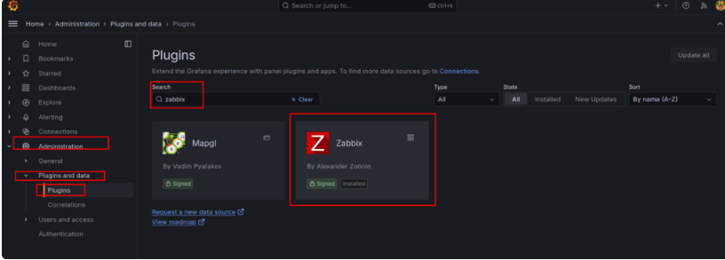
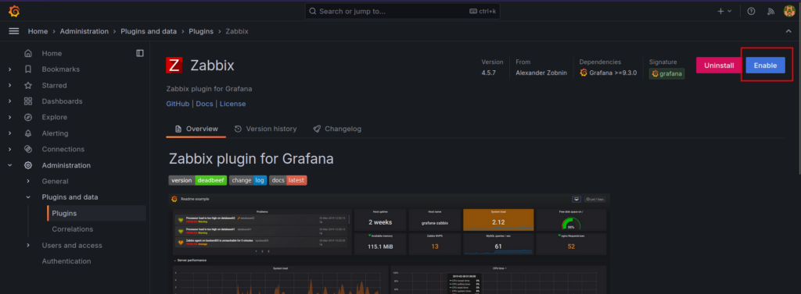
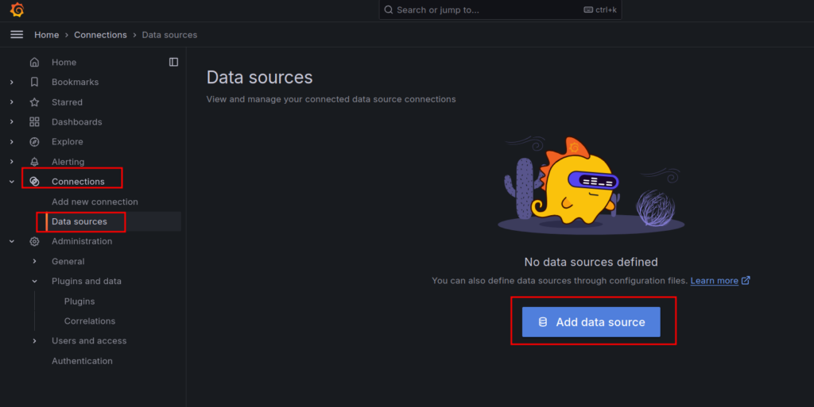
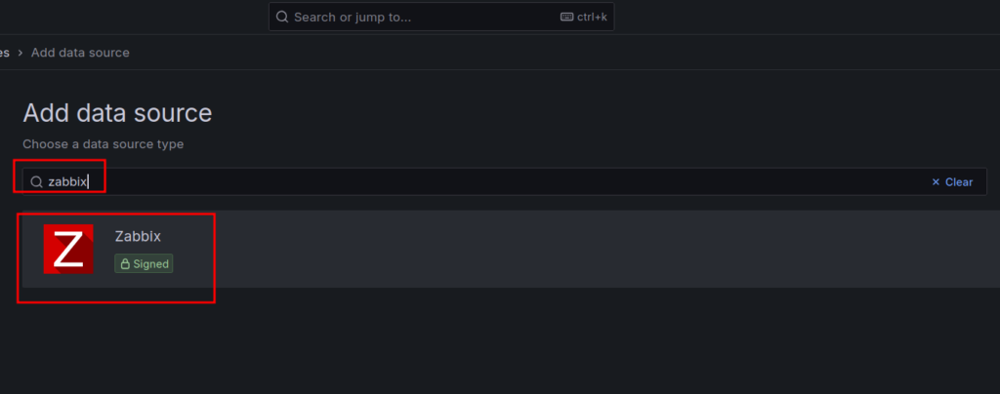
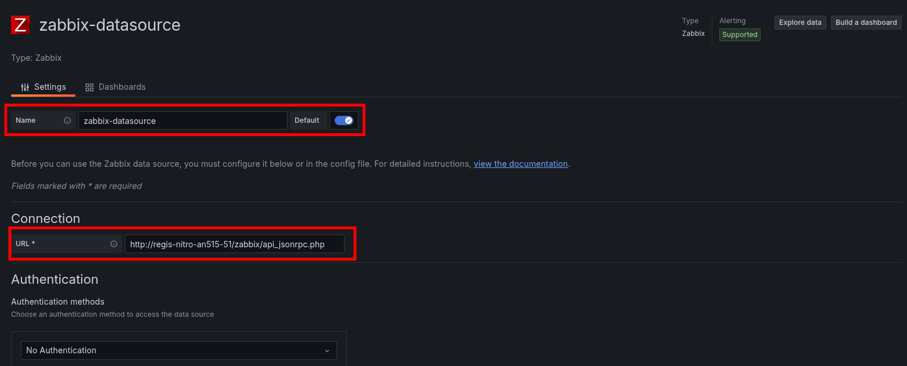
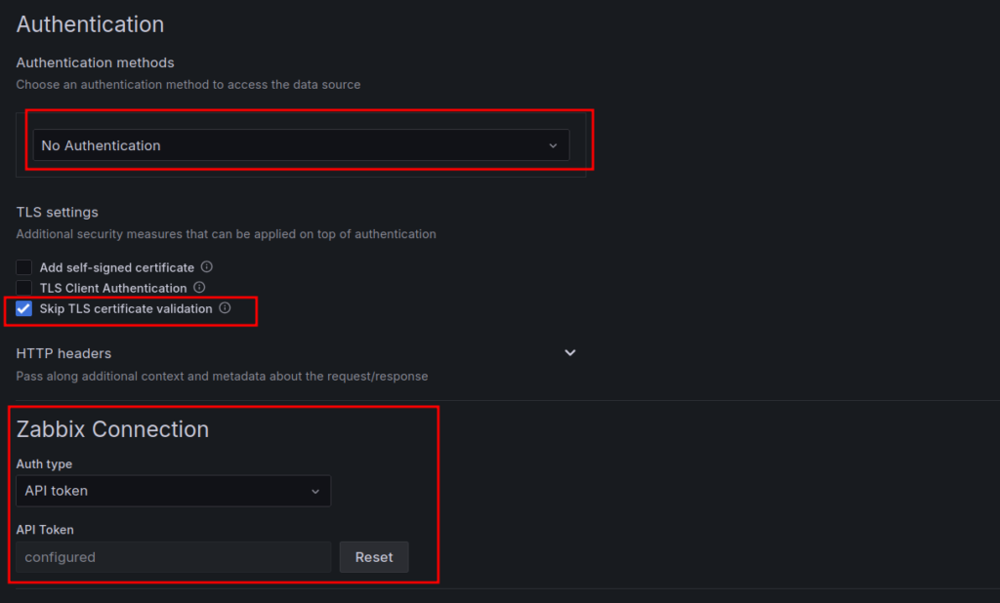
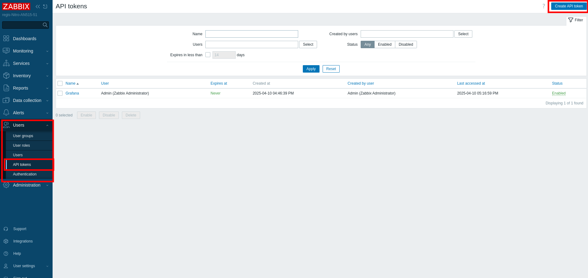
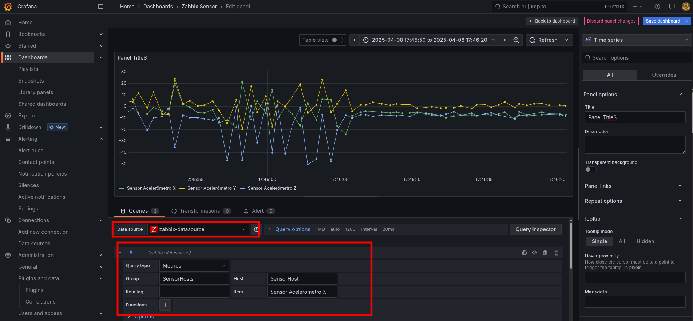

## Instalar o Grafana no Ubuntu

1. Atualize os pacotes do seu sistema:
   ```bash
   sudo apt-get update
   ```
2. Baixe o repositório do Grafana:
   ```bash
   sudo apt-get install -y software-properties-common
   sudo add-apt-repository "deb https://packages.grafana.com/oss/deb stable main"
   ```
3. Adicione a chave GPG do repositório:
   ```bash
   sudo apt-key adv --keyserver keyserver.ubuntu.com --recv-keys 70E9D3C4C2C60F8A
   ```
4. Atualize novamente os pacotes e instale o Grafana:
   ```bash
   sudo apt-get update
   sudo apt-get install grafana
   ```
5. Inicie o serviço do Grafana e habilite-o para iniciar automaticamente:
   ```bash
   sudo systemctl start grafana-server
   sudo systemctl enable grafana-server
   ```

6. Acesse o Grafana no navegador: [http://localhost:3000](http://localhost:3000) (usuário: **admin**, senha: **admin**).

---

## Instalar o Grafana no Windows

1. Baixe o instalador do Grafana para Windows no site oficial:  
   [Grafana Downloads](https://grafana.com/grafana/download).

2. Execute o instalador e siga as instruções de instalação.

3. Após a instalação, o Grafana será iniciado automaticamente. Acesse o painel do Grafana no navegador:  
   [http://localhost:3000](http://localhost:3000) (usuário: **admin**, senha: **admin**).


# Integração do Grafana com Zabbix

Este tutorial ensina como integrar o Grafana com o Zabbix utilizando o plugin Grafana-Zabbix. As instruções e imagens abaixo são baseadas no [tutorial da BF Networks](https://bfnetworks.com.br/como-configurar-a-integracao-do-grafana-com-zabbix/).

## Pré-requisitos

- **Grafana** instalado e em execução.
- **Zabbix** instalado e configurado. Para instalar o Zabbix você pode seguir o tutorial descrito neste [github](https://github.com/miguelsrrobo/zabbix-install).
- Acesso administrativo ao servidor onde o Grafana está instalado.
- Conhecimento básico de linha de comando e configuração de datasources.

## Passo 1: Instalar o Plugin Grafana-Zabbix

1. Abra o terminal do servidor onde o Grafana está instalado.
2. Execute o comando abaixo para instalar o plugin:
   ```bash
   grafana-cli plugins install alexanderzobnin-zabbix-app
   ```
3. Após a instalação, reinicie o serviço do Grafana:
   ```bash
   sudo systemctl restart grafana-server
   ```
## Passo 2: Habilitar o Plugin no Grafana

1. Acesse o painel do Grafana pelo navegador e faça login as credenciais relatadas no tutorial de instalação.
2. No painel do Grafana, acesse Administration > Plugins and data, e depois clique sobre Plugins. Procure na barra de pesquisa por Zabbix. Será mostrado como abaixo o plugin, clique sobre ele:

> **Imagem:**  
> 

Na página seguinte, procure pelo botão Enable como abaixo e clique para habilitar o plugin:


> **Imagem:**  
> 

## Passo 3: Configurar o Data Source do Zabbix
Depois de ativar o plugin, é necessário configurar o Zabbix como fonte de dados no Grafana.


1. Acesse Configuration > Data Sources no painel do Grafana e clique em Add data source.



2. Pesquise e clique sobre a opção Zabbix como tipo de fonte de dados.



3. Preencha os campos com as informações do seu servidor Zabbix:
   - **URL:** Informe o endereço do seu servidor Zabbix, incluindo o caminho para a API, por exemplo:  
     `http://seu-servidor/zabbix/api_jsonrpc.php`
   - **Access:** Selecione o modo de acesso adequado (geralmente, "Server").



4. Autentication: este você pode deixar como “No Authentication“, a parte das credencias para o zabbix você insere no próximo campo.

5. Skip TLS certificate validation: deixe essa opção marcada, caso use certificado autoassinado. Eu prefiro deixar logo marcado e recomendo caso você tenha dúvidas do que faz.

6. Zabbix Connection: aqui de você escolhe o método de autenticação para se conectar no Zabbix. Utiliza Usuário e senha ou API Token(suportado a partir das versões 6.0x do Zabbix)



Para conseguir o token você deve acessar o Zabbix, clicar em users depois em API images/tokens.png e criar um novo token. Depois de criar o token, copie o mesmo e cole no campo do Grafana.


Clique em Save & Test. Se aparecer a mensagem abaixo em verde, a conexão está funcional. 


## Passo 4: Criar um Dashboard com Painéis do Zabbix

Agora você pode começar a criar dashboards no Grafana com os dados do Zabbix.

Para criar um dashboard do zero, clique em Dashboard -> Create Dashboard e adicione um painel. Configure as consultas utilizando o Data Source do Zabbix e escolha as métricas desejadas.

> **Imagem:**  
> 

## Passo 5: Verificar e Ajustar a Visualização

1. Verifique se os painéis do dashboard estão exibindo os dados do Zabbix corretamente.
2. Se necessário, ajuste consultas, filtros e intervalos de tempo para melhorar a visualização.
3. Explore as opções do Grafana para configurar alertas e outras funcionalidades que melhorem seu monitoramento.

## Conclusão

Após seguir estes passos, seu Grafana estará integrado ao Zabbix, permitindo a criação de dashboards personalizados para monitoramento dos dados coletados pelo Zabbix. Caso encontre dificuldades, consulte as documentações oficiais:
- [Documentação do Grafana](https://grafana.com/docs)
- [Documentação do Zabbix](https://www.zabbix.com/documentation)

---

*Tutorial baseado no artigo [Como Configurar a Integração do Grafana com Zabbix](https://bfnetworks.com.br/como-configurar-a-integracao-do-grafana-com-zabbix/) da BF Networks.*

